Stage 1: Build the RAG API (FastAPI)
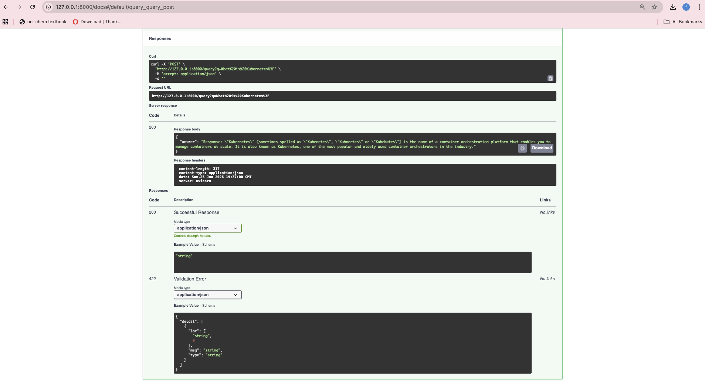
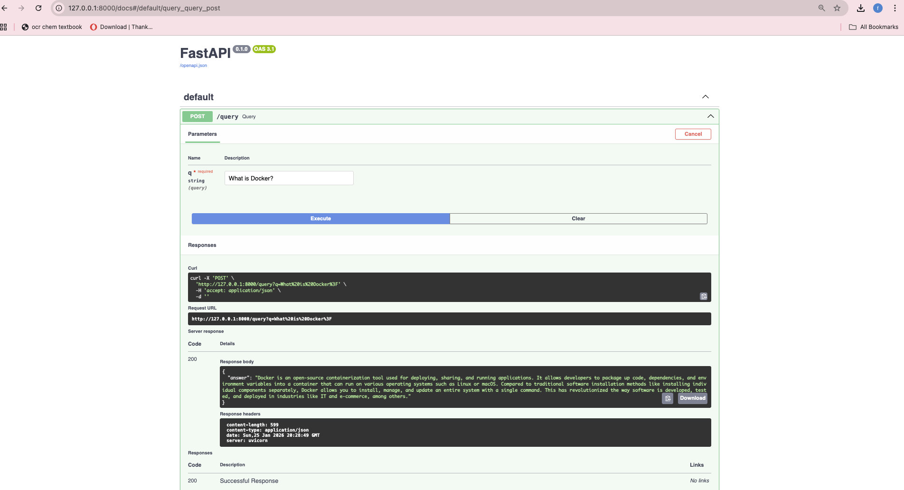
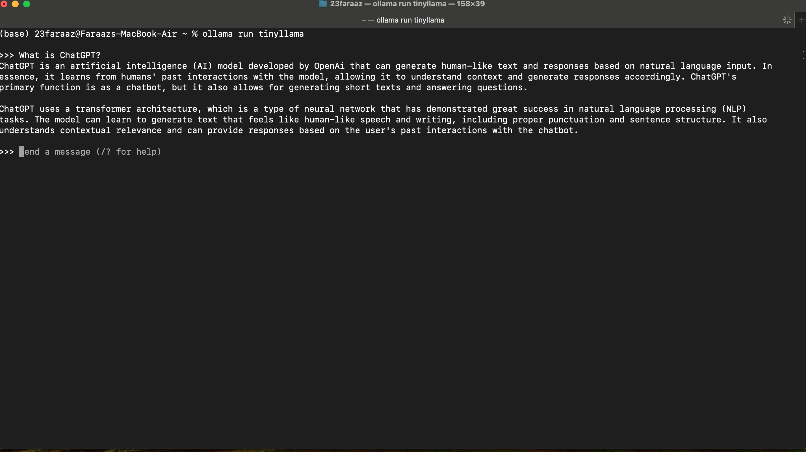
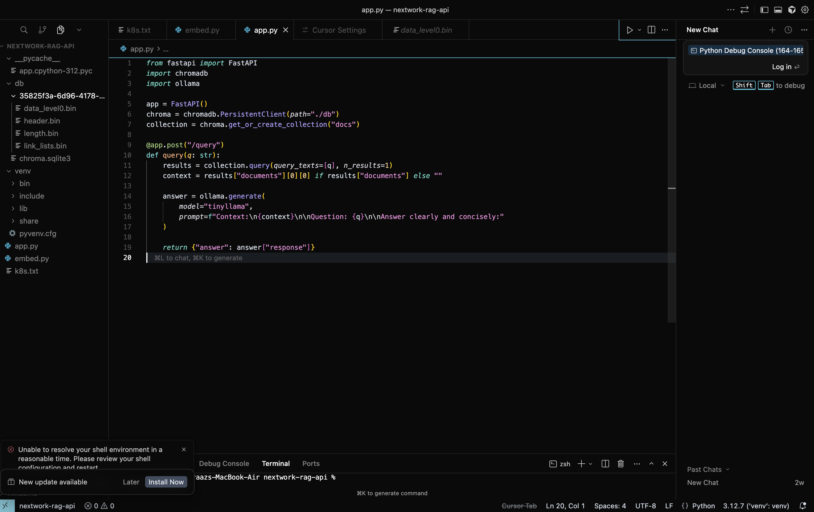
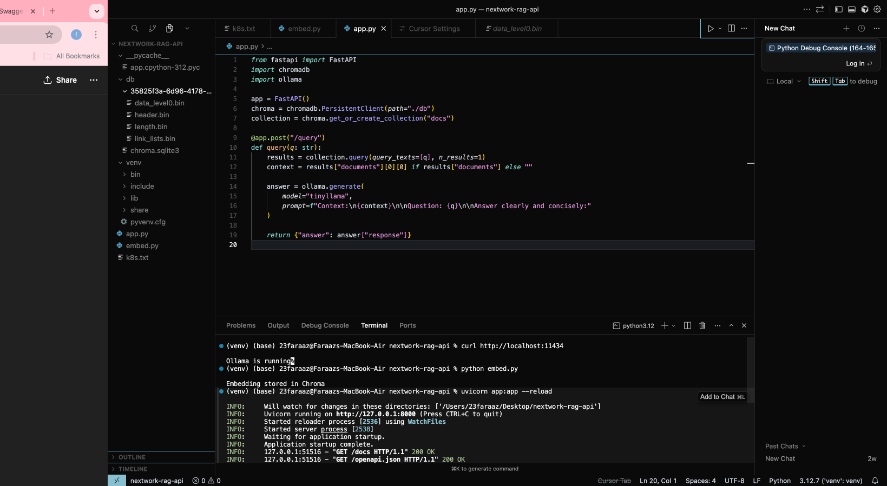

Implemented /query and /add endpoints using FastAPI

Stored document embeddings using ChromaDB for semantic retrieval

Integrated a local language model using Ollama

Tested the API using Swagger UI and curl

Stage 2: Containerisation with Docker
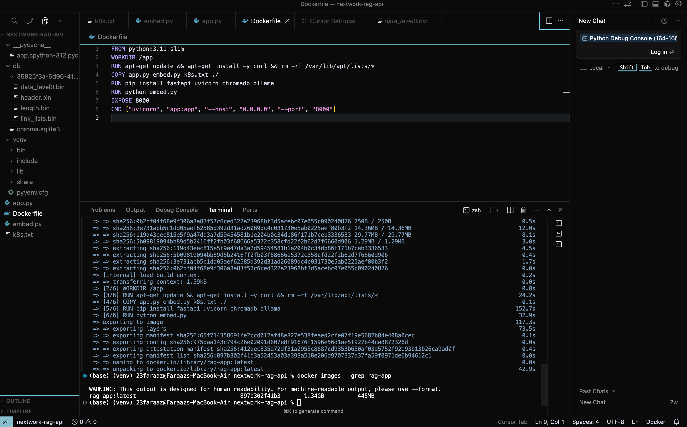
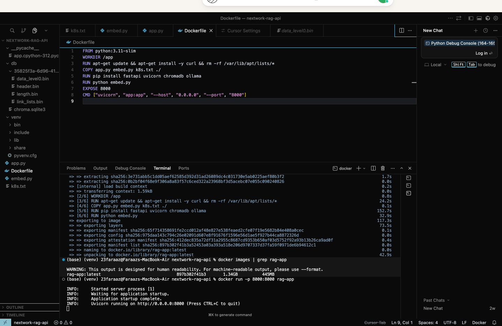
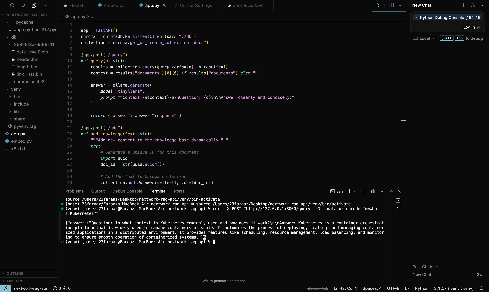
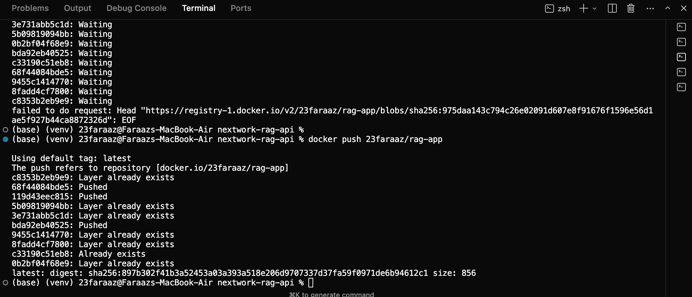
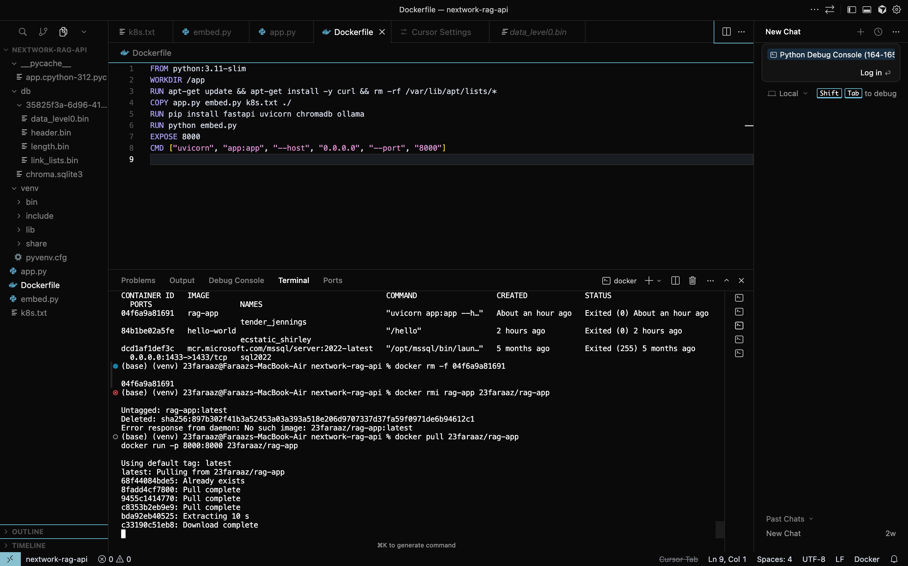

Created a Dockerfile to package the application and dependencies

Built and ran the container locally

Published the image to Docker Hub

Verified the image could be pulled and run in a clean environment

Stage 3: Kubernetes Deployment

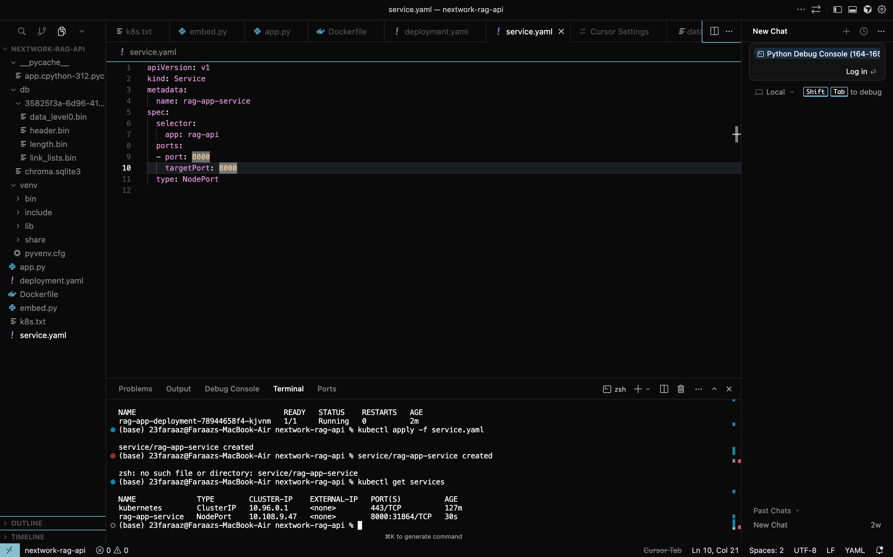
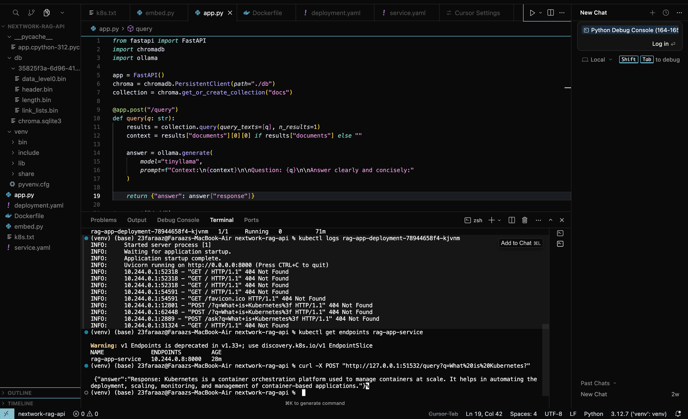

Deployed the Docker image to a local Kubernetes cluster using Minikube

Used a Deployment to manage Pods declaratively

Exposed the application using a NodePort Service

Verified request flow from local machine to Pods via the Service

Stage 4: Self-Healing and Reliability
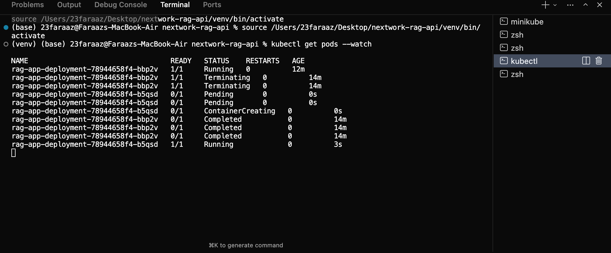
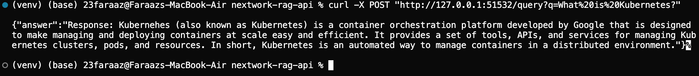

Manually deleted running Pods

Observed Kubernetes automatically create replacement Pods

Confirmed the Service continued routing traffic without changes

Stage 5: CI/CD with GitHub Actions
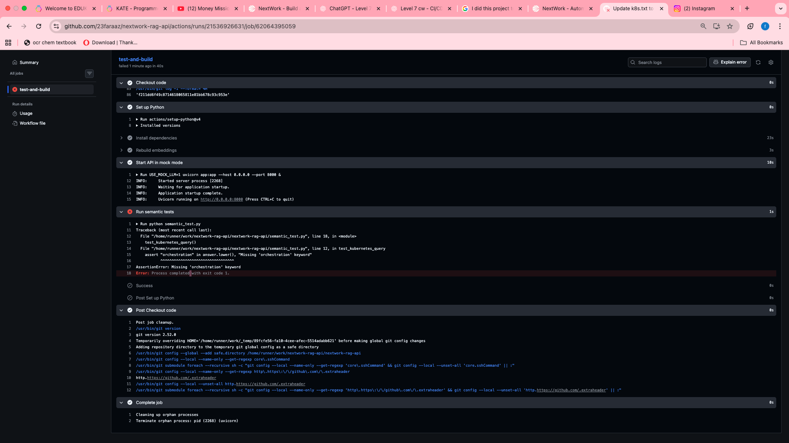
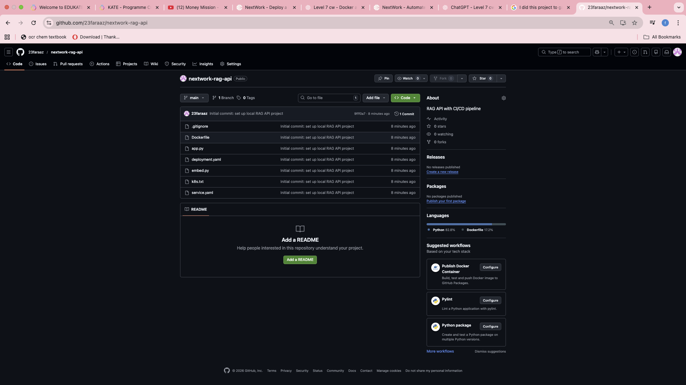
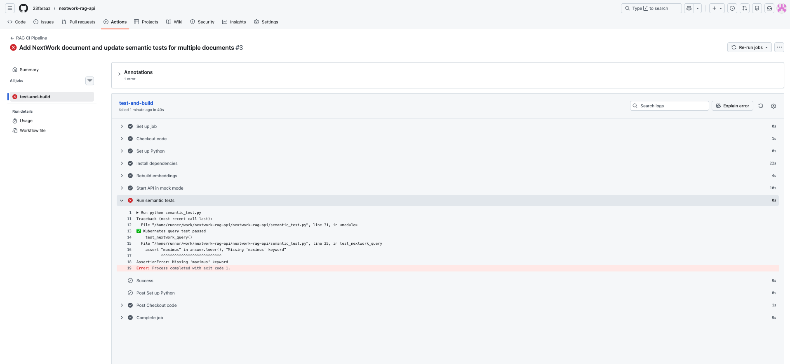

Created a GitHub Actions workflow triggered on every push

Rebuilt embeddings and ran semantic tests in CI

Introduced a mock LLM mode to make tests deterministic

Observed CI failures when knowledge-base changes broke expected behaviour
